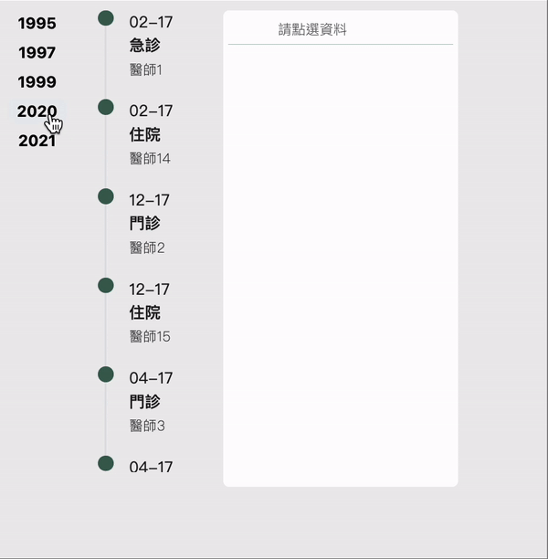

# Timeline

This project was generated with [Angular CLI](https://github.com/angular/angular-cli) version 16.1.7.

## Timeline 畫面

## Timeline 使用說明

- 使用需要在外層限制高度， 如 `app.component.html` 的 `class="outside"`，使用 `height: 98vh`去限制
- 會分析傳入的資料之時間，將年月顯示在左側為選單。
- 將每筆資料在對應的時間軸中顯示。
- 點選時間軸項目會顯示更詳細的資訊在其右側列表。
- `input` 為 所有的病史資料傳入，型別為 `TimeItem[]`。
- `output` 是在選擇其中一筆資料時會將對應資料傳出，型別為 `TimeItem`。

## Timeline 資料結構

傳入的病史紀錄須符合 `interface TimeItem[]`
- `id`: 辨識用唯一值
- `date`: 時間
- `title`: 醫師
- `subtitle`: 就診類別，如門診，急診，住院
- `icon?`: 供住院類別使用，如有每週總結，可選擇icon樣式
- `subItems?`: 詳細記錄
